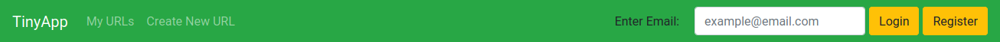
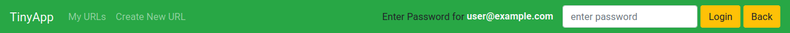
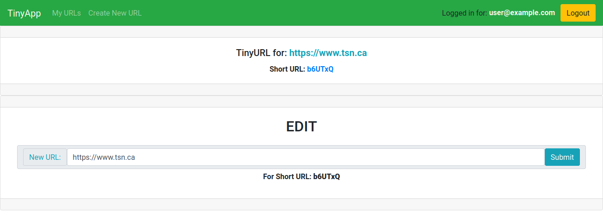
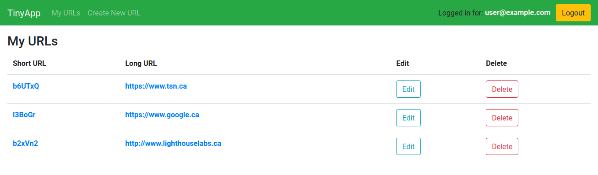

# TinyApp Project

>TinyApp is a full stack web application built with Node and Express that allows users to shorten long URLs (à la bit.ly).

This app was refactored to be more in line as a **single page application (SPA)** the new url and login pages are not neccessary for my app. SPA are better for user experience and design, they reduce clicks and reduce rendering and they present a better architecture of the site. A stretch goal is to complete this proccess.

## Final Product

## Dependencies

- Node.js
- Express
- EJS
- bcrypt
- body-parser
- cookie-session

## Getting Started

- Install all dependencies (using the `npm install` command).
- Run the development web server using the `node express_server.js` command.

## Description

This is a fully functional web-server and API

Works like other URL shortening services [TinyURL](http://tinyurl.com/), [Bitly](https://bitly.com/) or [Goo.gl](https://goo.gl/)

[Short Wikipedia Article about URL shortening](https://en.wikipedia.org/wiki/URL_shortening#Techniques)